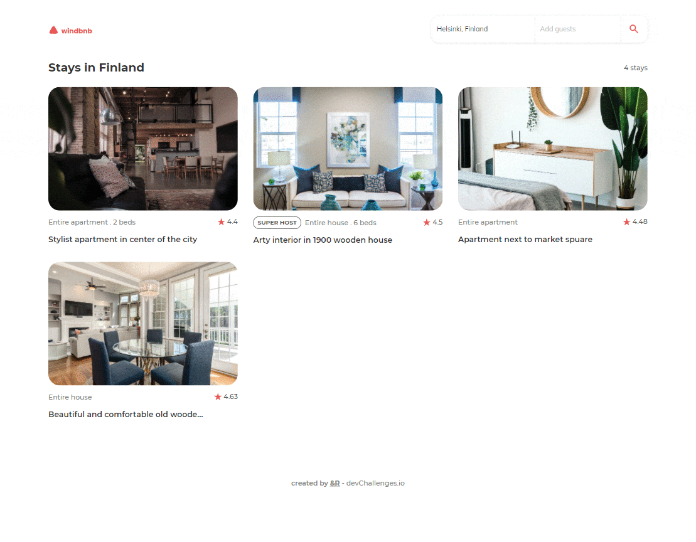

<!-- Please update value in the {}  -->

<h1 align="center">Windbnb</h1>

<div align="center">
   Solution for a challenge from  <a href="http://devchallenges.io" target="_blank">Devchallenges.io</a>.
</div>

<div align="center">
  <h3>
    <a href="https://rauboluk.github.io/Windbnb/">
      Demo
    </a>
    <span> | </span>
    <a href="https://github.com/RauboLuk/Windbnb">
      Solution
    </a>
    <span> | </span>
    <a href="https://devchallenges.io/challenges/3JFYedSOZqAxYuOCNmYD">
      Challenge
    </a>
  </h3>
</div>

<!-- TABLE OF CONTENTS -->

## Table of Contents

- [Overview](#overview)
  - [Built With](#built-with)
- [Features](#features)
- [How to use](#how-to-use)
- [Contact](#contact)
- [Acknowledgements](#acknowledgements)

<!-- OVERVIEW -->

## Overview


ETC~29h

### Built With

- [React](https://reactjs.org/)
- [React Redux](https://react-redux.js.org/)
- [Redux Toolkit](https://redux-toolkit.js.org/)
- [Tailwind](https://tailwindcss.com/)
- [Testing Library](https://testing-library.com/)
<!-- - [CRACO](https://www.npmjs.com/package/@craco/craco)
- [Material-UI icons](https://material-ui.com/)
- [pluralize](https://www.npmjs.com/package/pluralize) -->

## Features

This application/site was created as a submission to a [DevChallenges](https://devchallenges.io/challenges) challenge. The [challenge](https://devchallenges.io/challenges/3JFYedSOZqAxYuOCNmYD) was to build an application to complete the given user stories.

- [x] **User story**: I can see a list of properties
- [x] **User story**: I can see the property card with a name, rating, apartment type, and super host
- [x] **User story**: I can open the filter drawer
- [x] **User story**: I can filter properties by location and number of guests
- [x] **User story**: I can see the number of filtered items
- [x] **User story**: I can see pages following given designs

## How To Use

<!-- Example: -->

To clone and run this application, you'll need [Git](https://git-scm.com) and [Node.js](https://nodejs.org/en/download/) (which comes with [npm](http://npmjs.com)) installed on your computer. From your command line:

```bash
# Clone this repository
$ git clone https://github.com/your-user-name/your-project-name

# Install dependencies
$ npm install

# Run the app
$ npm start
```

## Acknowledgements

- [Asserting elements are not present](https://stackoverflow.com/a/52783201)
- [Five Things You (Probably) Didn't Know About Testing Library](https://polvara.me/posts/five-things-you-didnt-know-about-testing-library)

## Contact

- GitHub [@RauboLuk](https://github.com/RauboLuk)
- Stack Overflow [@RauboLuk](https://stackoverflow.com/users/9185799/rauboluk)
